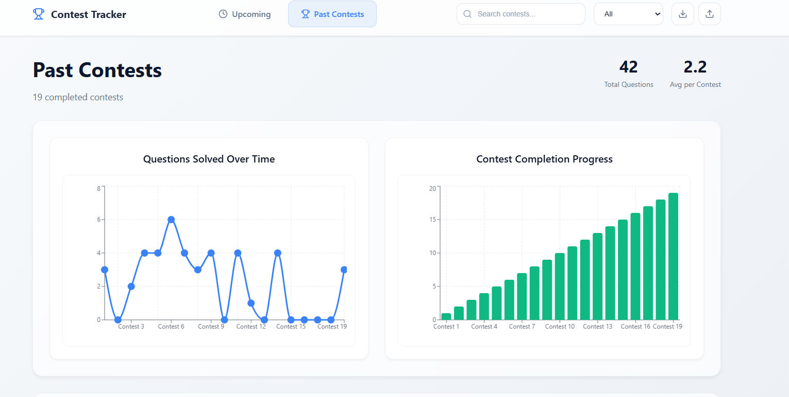

# Contest Manager 🚀
A full-stack web application to track and manage coding contest participation across multiple platforms.

---

<div align="center">
  
  
  
  
</div>

---

## Demo

<div align="center">
  
</div>

---

## Features

### Contest Management
- Add, edit, delete contests across **LeetCode, Codeforces, AtCoder, HackerRank, CodeChef, TopCoder**  
- Mark contests completed with **questions solved count**  
- Visual indicators for upcoming and past contests  
- Filter & search contests in real-time

### Data Persistence
- MongoDB database for reliable storage  
- RESTful API for all CRUD operations  
- Import/export contest data (JSON)  
- Automatic synchronization between frontend and backend

### Performance Analytics
- Track **questions solved per contest**  
- Visual performance graphs & statistics  
- Platform-specific performance metrics  
- Overall completion tracking

### User Interface
- Responsive for desktop & mobile  
- Modern **glassmorphism** UI design  
- Intuitive navigation & UX

---

## Tech Stack

<div align="center">
  
  
  
  
  
  
  
  
  
  
  
  
  
</div>

---

## Installation

### Prerequisites
- Node.js v16+  
- MongoDB (local or Atlas)  
- npm or yarn

### Backend Setup
```bash
cd server
npm install
# configure .env
npm run dev
Frontend Setup
```
```bash
cd ..
npm install
npm run dev
```
Access frontend at http://localhost:5173 and backend at http://localhost:5000.

## API Endpoints

### Contests
- `GET /api/contests` → All contests
- `GET /api/contests/upcoming` → Upcoming contests
- `GET /api/contests/past` → Completed contests
- `GET /api/contests/:id` → Contest details
- `POST /api/contests` → Add new contest
- `PUT /api/contests/:id` → Update contest
- `PUT /api/contests/:id/mark-done` → Mark as completed
- `DELETE /api/contests/:id` → Delete contest

### Stats
- `GET /api/contests/stats/summary` → Performance metrics

### Health
- `GET /api/health` → Server status

## Database Schema
```javascript
{
  name: String,
  platform: ['LeetCode','Codeforces','AtCoder','HackerRank','CodeChef','TopCoder'],
  date: Date,
  time: String,
  link: String,
  done: Boolean,
  questionsSolved: Number,
  completedDate: Date,
  createdAt: Date,
  updatedAt: Date
}
```
## Project Structure
```bash
lua
Copy code
ContestManager/
├── src/
│   ├── components/
│   ├── pages/
│   ├── services/
│   ├── styles/
│   ├── App.jsx
│   └── main.jsx
├── server/
│   ├── config/
│   ├── models/
│   ├── routes/
│   └── server.js
├── package.json
├── vite.config.js
└── README.md
```
## Usage
- Add, edit, delete contests easily
- Mark contests as complete & track questions solved
- View detailed performance analytics and charts
- Import/export contest data in JSON

## Development & Scripts

### Frontend
- `npm run dev` → start dev server
- `npm run build` → production build
- `npm run preview` → preview production
- `npm run lint` → lint code

### Backend
- `npm run dev` → start with nodemon
- `npm start` → production

## Deployment

### Local Network
- Bind `vite.config.js` & `server.js` to `0.0.0.0` for LAN access
- Access via `http://YOUR_IP:5173`

### Production
- Configure env vars, CORS, logging & optimizations

## Future Enhancements
- Multi-user support & authentication
- Notifications & reminders
- Advanced analytics & reporting
- Mobile app integration
- Platform API integration

## Author
- [Sudhanshu Shukla](https://sudhanshu-shukl.github.io/portfolio)

Commit 1 at 2025-09-19 00:50:39

Commit 2 at 2025-09-19 00:50:39

Commit 3 at 2025-09-19 00:50:40

Commit 4 at 2025-09-19 00:50:40

Commit 5 at 2025-09-19 00:50:40

Commit 6 at 2025-09-19 00:50:41

Commit 7 at 2025-09-19 00:50:41

Commit 1 at 2025-09-20 01:00:55

Commit 2 at 2025-09-20 01:00:55

Commit 3 at 2025-09-20 01:00:55

Commit 4 at 2025-09-20 01:00:55

Commit 5 at 2025-09-20 01:00:55

Commit 6 at 2025-09-20 01:00:55

Commit 7 at 2025-09-20 01:00:56

Commit 1 at 2025-09-21 03:57:18

Commit 2 at 2025-09-21 03:57:18

Commit 3 at 2025-09-21 03:57:18
